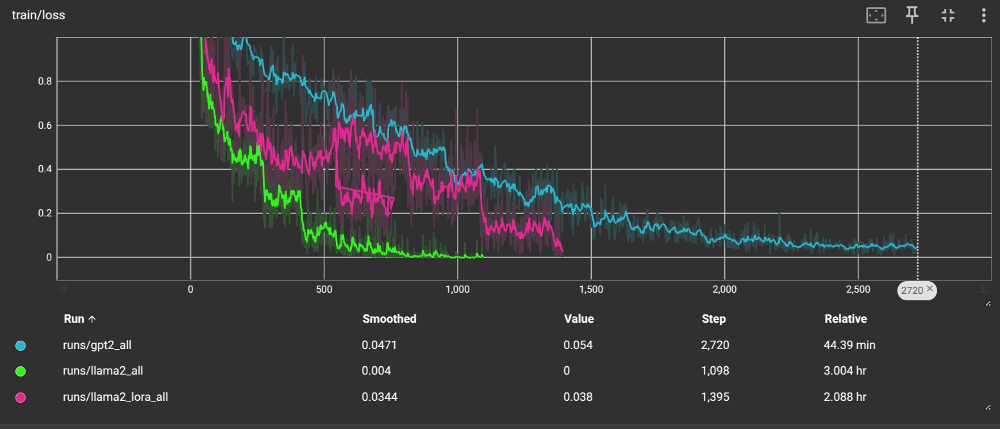
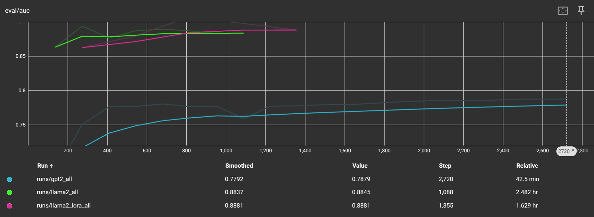
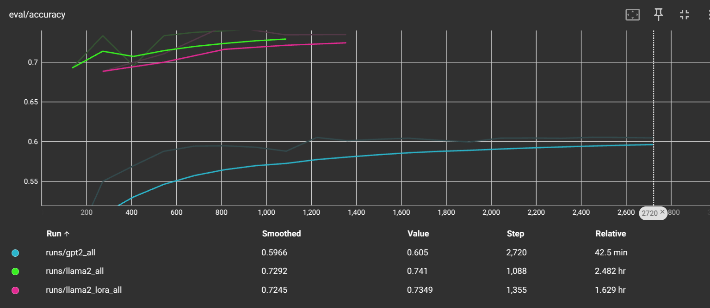

# LlamaSentimentClassification

## **QLoRA Training Report - LLaMA2-7B**

| **Category**          | **Details** |
|----------------------|------------|
| **Base Model**       | LLaMA2-7B (6.65B params) |
| **Quantization**     | 4-bit (BitsandBytes) |
| **Quant Type**       | `nf4` (Normalized Float 4) |
| **Compute Dtype**    | `float16` |
| **Double Quantization** | `false` |
| **Cache Usage**      | `false` |

### **LoRA Configuration**
| **Parameter**         | **Value**  |
|----------------------|------------|
| **LoRA Rank (r)**    | 16 |
| **LoRA Alpha**       | 64 |
| **LoRA Dropout**     | 0.1 |
| **Bias**             | `none` |
| **Task Type**        | `SEQ_CLS` |
| **Targeted Modules** | `q_proj, k_proj, v_proj, o_proj, up_proj, down_proj, gate_proj` |

### **Training Efficiency**
| **Metric**             | **Value**  |
|----------------------|------------|
| **Trainable Parameters** | **12,288** |
| **Total Parameters**     | **6,647,345,152** |
| **Trainable %**         | **0.0002%** |

### **Evaluation Metrics**
| **Metric**                 | **Value**  |
|---------------------------|------------|
| **Eval Loss**             | 2.287 |
| **Eval Accuracy**         | **70.183%** |
| **Eval AUC**              | **0.859** |

## **LoRA Training Report - LLaMA2-7B**

| **Category**          | **Details** |
|----------------------|------------|
| **Base Model**       | LLaMA2-7B (6.65B params) |
| **Quantization**     | None |

### **LoRA Configuration**
| **Parameter**         | **Value**  |
|----------------------|------------|
| **LoRA Rank (r)**    | 16 |
| **LoRA Alpha**       | 64 |
| **LoRA Dropout**     | 0.1 |
| **Bias**             | `none` |
| **Task Type**        | `SEQ_CLS` |
| **Targeted Modules** | `q_proj, k_proj, v_proj, o_proj, up_proj, down_proj, gate_proj` |

### **Training Efficiency**
| **Metric**             | **Value**  |
|----------------------|------------|
| **Trainable Parameters** | **12,288** |
| **Total Parameters**     | **6,647,345,152** **(7B)**|
| **Trainable %**         | **0.0002%** |

### **Evaluation Metrics**
| **Metric**                 | **Value**  |
|---------------------------|------------|
| **Eval Loss**             | 1.0556 |
| **Eval Accuracy**         | **68.766%** |
| **Eval AUC**              | **0.855** |

## **Training Report - GPT-2**

#### **Model & Training Configuration**
| **Category**          | **Details** |
|----------------------|------------|
| **Base Model**       | GPT-2 |
| **Total Parameters** | **124,442,112 (124M)**|
| **Quantization**     | None |

#### **Training Efficiency**
| **Metric**             | **Value**  |
|----------------------|------------|
| **Trainable Parameters** | 124,442,112 |
| **Total Parameters**     | 124,442,112 |
| **Trainable %**         | 100% |

#### **Evaluation Metrics**
| **Metric**                 | **Value**  |
|---------------------------|------------|
| **Eval Loss**             | 2.6238 |
| **Eval Accuracy**         | 53.49% |
| **Eval AUC**              | 0.7259 |

## Training Graphs

### **Train Loss**

### **Eval AUC**

### **Eval Accuracy**
